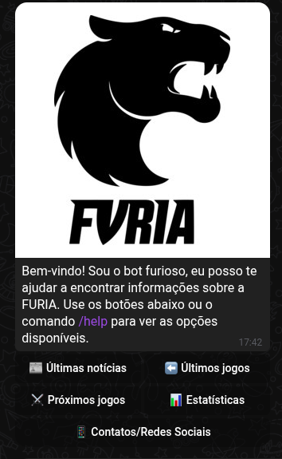

# FURIA_ChatBOT
[](https://nodejs.org/)[](https://nestjs.com/)[](https://core.telegram.org/bots)[](http://localhost:3000/api) 
[](LICENSE)

Esse projeto é um chat bot para telegram que fornece algumas informações sobre a equipe da FURIA, mais focado no time de CS, o projeto foi desenvolvido como desafio técnico para uma vaga na FURIA.


## Rodando localmente

Clone o projeto

```bash
  git clone https://github.com/EduardoFerreiraB/FURIA-Challenge-1
```

Entre no diretório do projeto

```bash
  cd FURIA-Challenge-1
```

Instale as dependências

```bash
  npm install
```

**Para rodar localmente você vai precisar obter um token API de um bot no Telegram** 

1.Crie um bot no Telegram

Abra o Telegram e procure pelo usuario [BotFather.](https://t.me/BotFather)

Inicie uma conversa com /newbot

Siga as instruções para escolher um nome para o bot e um nome de usuario unico para o bot

Após criar o bot, você vai receber um **token de API** algo como:
```bash
  123456789:ABCDefghIJKLmnopQRSTuvwxYZ1234567890
```
Guarde esse token.

**Configurando o token no projeto**

Abra a pasta do projeto novamente e crie um arquivo .env na raiz do projeto.

Adicione o token ao arquivo .env

```bash
  BOT_TOKEN=123456789:ABCDefghIJKLmnopQRSTuvwxYZ1234567890
```
**Token configurado**

Inicie o servidor

```bash
  npm run start:all
```

## Como usar o chat
**Para usar o chat acesse o seguinte link do chat no telegram:
[FuriaChatBOT](https://t.me/ChallengeFuriabot)

**Se você quiser testar o seu chat que vai rodar localmente siga esses passos:**

Depois de tudo configurado e o servidor rodando é hora de usar o chat.

Ao criar o chat no telegram junto com o Token API você vai ter também o link para acessar o seu chat, geralmente é algo como t.me/UsernameDoSeuBot ou pode acessar pesquisando por @UsernameDoSeuBot

Para começar use o comando /start para iniciar a conversa com o bot.



Como pode ver você tem 5 opções de comandos.

**Últimas notícias**

   - Te mostra as ultimas nóticias sobre o time da furia.

**Últimos jogos**

   - Te mostra os ultimos jogos da furia.

**Próximos jogos**

   - Te mostra qual sera o proximo confronto da furia, com data e time adversario.

**Estátisticas**

   - Te traz duas opções para escolher:

       - **Estátisticas do time**
           
          - Mostra as Estátisticas geral do time da furia.
    
       - **Estátisticas de um Player especifico**
       
          - Você pode escolher um dos 5 jogadores do time da furia para ver as estátisticas pessoais do Player.

**Contatos/Redes Sociais**

   - Essa opção é para deixar você torcedor mais perto do time da FURIA, com o link de todos os contatos da FURIA, site, Whatsapp, X/Twitter e Instagram.


Essas são as opções do Chat, é simples e prático navegar por elas e ficar por dentro de tudo sobre o time de CS da FURIA.
## Documentação

[Documentação](http://localhost:3000/api#/)

